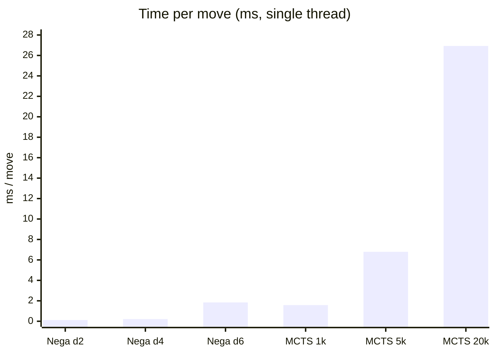
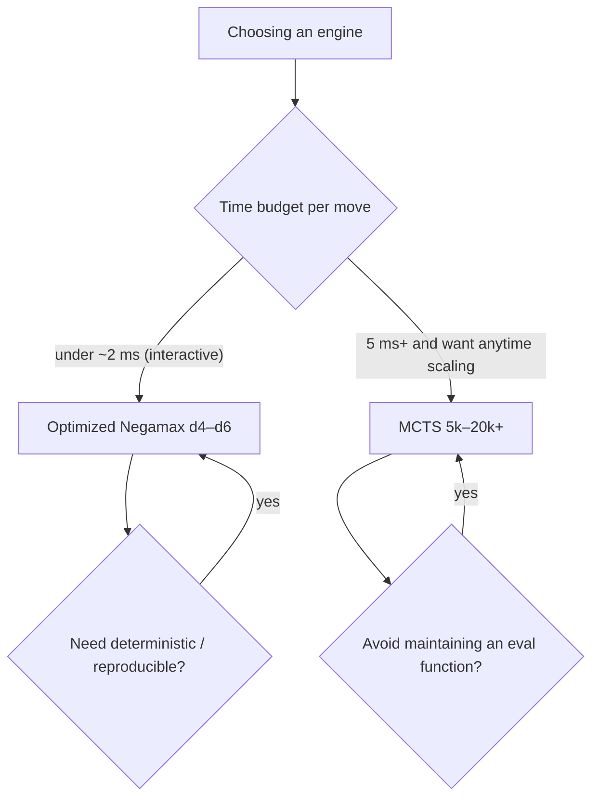

# Performance Analysis: Negamax vs MCTS

Benchmarks of the two AI engines: first against a uniform-random baseline (to
gauge raw strength and how it scales), then **head-to-head against each other and
normalized by compute time** (the section that actually answers "which is
better"). The random benchmark also surfaced a depth-parity bug in the negamax
evaluation, since fixed; both fixed and original (buggy) numbers are shown.

**TL;DR:** the optimized negamax (alpha-beta + transposition table + move
ordering) is stronger *per millisecond* and is the better default for interactive
play; MCTS wins only when given several times more time per move, but scales
smoothly and needs no evaluation function. See
[Optimized Negamax vs MCTS](#optimized-negamax-vs-mcts--which-is-better).

## Methodology

- **Harness:** [`bench_vs_random.cpp`](bench_vs_random.cpp). Each configuration plays
  a fixed number of complete games against the random bot, **alternating who moves
  first** (the engine plays X in half the games and O in the other half) to remove
  first-move bias.
- **Metric:** win-rate from the engine's perspective, `(wins + 0.5·draws) / games`.
- **Determinism:** every game uses a distinct seed; the random opponent is seeded
  per game, and each engine move is given a fresh sub-seed.
- **Build:** `g++ -O3 -std=c++17` (Apple clang, single thread).
- **Reproduce:** `g++ -O3 -std=c++17 bench_vs_random.cpp -o bench && ./bench`

## Results (current engine)

### Negamax vs Random

| Depth | Games | W | D | L | Win-rate |
|------:|------:|--:|--:|--:|---------:|
| 1     | 300   | 245 | 2 | 53 | **82.0%** |
| 2     | 300   | 295 | 3 | 2  | **98.8%** |
| 3     | 300   | 299 | 1 | 0  | **99.8%** |
| 4     | 200   | 198 | 2 | 0  | **99.5%** |
| 5     | 200   | 199 | 0 | 1  | **99.5%** |
| 6     | 100   | 100 | 0 | 0  | **100.0%** |

### MCTS vs Random

| Iterations | Games | W | D | L | Win-rate |
|-----------:|------:|--:|--:|--:|---------:|
| 100        | 300   | 294 | 5 | 1 | **98.8%** |
| 500        | 300   | 299 | 0 | 1 | **99.7%** |
| 1000       | 200   | 200 | 0 | 0 | **100.0%** |
| 5000       | 150   | 150 | 0 | 0 | **100.0%** |
| 20000      | 80    | 80  | 0 | 0 | **100.0%** |

## The depth-parity bug (found here, then fixed)

The first run of this benchmark produced a bizarre win-rate that **zig-zagged
with search depth**, with depth 1 actually *losing* to random:

| Depth | 1 | 2 | 3 | 4 | 5 | 6 |
|------:|--:|--:|--:|--:|--:|--:|
| buggy win-rate | 19.3% | 83.8% | 53.7% | 78.5% | 56.5% | 75.0% |
| fixed win-rate | 82.0% | 98.8% | 99.8% | 99.5% | 99.5% | 100.0% |

**Root cause.** `negamax::evaluate()` scored the position from a *fixed* root-mover
perspective while the negamax recursion negates the child value at every ply.
Correct negamax requires the leaf evaluation to be relative to the side to move at
that leaf. Because it was fixed:

- At **even** search depths the deepest ply lands on the root mover, the parity
  lines up, and the search behaved as correct minimax.
- At **odd** search depths the deepest ply is the opponent's, so the frontier was
  scored from the wrong side and the extra negation inverted it — the engine then
  *minimized its own evaluation* at the frontier. At depth 1 it deliberately picked
  its worst-looking move, hence sub-random results.

This was a quirk inherited from the original engine and preserved through the
bitboard rewrite. The rewrite had verified the search computes its value function
*consistently* (order-independent, matching an exhaustive no-pruning minimax of
that recurrence) — but the recurrence itself was strategically wrong at odd depths.
Strength benchmarking is what exposed it.

**The fix.** Evaluate every node from the side to move (`evaluate(st, st.to_move ==
'X', w)`) and treat any completed meta line as "the side to move has already lost"
(`return -meta_win`). Win-rate now rises monotonically with depth, odd/even parity
is gone, and the engine remains order-independent (verified: identical move output
with move ordering on and off). Note this changes the engine's move choices, so any
weights tuned against the old objective should be re-tuned.

## Findings

1. **Negamax now scales correctly** — win-rate climbs monotonically and is
   essentially perfect (≈100%) from depth 3 upward. Even depth 1 (a 1-ply
   look-ahead) now wins 82%.

2. **MCTS is near-perfect from a tiny budget** — ~99% at 100 iterations, a clean
   100% from 1000 on.
   > **Caveat:** MCTS's default playouts are uniform-random, so its rollouts model
   > a *random* opponent exactly — this is close to an ideal-case matchup and
   > overstates its edge against a strong opponent. (Head-to-head, ~20k-iteration
   > MCTS also beats depth-4 negamax.)

3. **Random is now a saturated yardstick** — both engines reach ~100% at modest
   settings, so this benchmark no longer discriminates between strong
   configurations. Measuring skill *beyond* random requires stronger baselines.

## Recommendations

1. **Re-tune the negamax weights** against the corrected search (the previous
   tuning targeted the flawed objective).
2. **Head-to-head matrix — done** (see the next section). Remaining: add
   iterative-deepening negamax with time control so the two can be compared at a
   *matched* time budget beyond depth 6.
3. Consider a light/heuristic MCTS rollout policy and a time-based budget for a
   fairer, stronger MCTS.

## Optimized Negamax vs MCTS — which is better?

Against random both engines are saturated, so the decisive test is how they do
**against each other**, and at what compute cost. Data below is from
[`bench_head2head.cpp`](bench_head2head.cpp): 40 games per pairing, alternating
colors, single thread, corrected (side-to-move) negamax with TT + move ordering.

### Cost — time per move

The two engines live in very different cost regimes. Negamax with alpha-beta +
transposition table + move ordering searches a depth-6 tree in under 2 ms;
MCTS's cost is linear in its iteration budget.

```
Time per move (ms, single thread)          (bar = relative cost)
Negamax d2   0.12  ▏
Negamax d4   0.21  ▏
Negamax d6   1.84  ███
MCTS  1000   1.58  ██▌
MCTS  5000   6.79  ███████████
MCTS 20000  26.93  ████████████████████████████████████████████
```

<!-- Renders as a chart on GitHub -->


### Head-to-head win rates (MCTS's perspective)

🔵 = MCTS favored (>55%) · ⚪ = roughly even (45–55%) · 🟠 = Negamax favored (<45%)

| Negamax ↓ / MCTS → | 1000 (1.6 ms) | 5000 (6.8 ms) | 20000 (26.9 ms) |
|---|:--:|:--:|:--:|
| **d2** (0.12 ms) | 77.5% 🔵 | 85.0% 🔵 | 91.2% 🔵 |
| **d4** (0.21 ms) | 35.0% 🟠 | 51.2% ⚪ | 85.0% 🔵 |
| **d6** (1.84 ms) | 31.2% 🟠 | 58.8% 🔵 | 66.2% 🔵 |

MCTS win-rate as its budget grows (each track is 0–100%, `│` marks 50%):

```
vs Negamax d2   1000   ████████████████░░░░  77.5%
                5000   █████████████████░░░  85.0%
               20000   ██████████████████░░  91.2%
vs Negamax d4   1000   ███████░░░░░░░░░░░░░  35.0%
                5000   ██████████░░░░░░░░░░  51.2%
               20000   █████████████████░░░  85.0%
vs Negamax d6   1000   ██████░░░░░░░░░░░░░░  31.2%
                5000   ████████████░░░░░░░░  58.8%
               20000   █████████████░░░░░░░  66.2%
                              │ 50%
```

Reading it: against a *weak* negamax (d2) MCTS wins at any budget; against a
*strong* negamax (d4/d6) MCTS **loses** at 1000 iterations and only pulls ahead
once given 5–20k.

### The decisive comparison — strength at equal time

Win rates alone favor "just give MCTS more iterations." Normalizing by
**time per move** flips the picture:

| Time budget | Negamax config | MCTS config | Winner |
|---|---|---|---|
| **~1.7 ms** | d6 (1.84 ms) | 1000 (1.58 ms) | **Negamax 68.8%** |
| ~0.2 ms vs 1.6 ms | d4 (0.21 ms) | 1000 (1.58 ms) | **Negamax 65%** — using ⅛ the time |
| ~6.8 ms | (d6 = 1.8 ms; no deeper config tested) | 5000 (6.79 ms) | MCTS 58.8% vs d6 |
| ~27 ms | (only up to d6 tested) | 20000 (26.9 ms) | MCTS 66.2% vs d6 |

**At equal wall-clock, optimized Negamax is stronger** — depth 6 beats MCTS-1000
better than 2-to-1 at the same ~1.7 ms, and depth 4 beats MCTS-1000 while
spending an eighth of the time. MCTS only wins by spending **4–30× more time per
move** than the negamax configs it beats.

> **Caveat:** the matrix caps negamax at depth 6. A fully time-fair test at ~27 ms
> would pit MCTS-20000 against negamax depth 8+, which was not run — so "MCTS-20k
> wins" means *against negamax ≤ d6*, not against a time-matched negamax.

### Why each wins where it does

| Dimension | Optimized Negamax | MCTS |
|---|---|---|
| Time to a strong move | **sub-ms – 2 ms** | 5 – 27 ms |
| Strength per millisecond | **higher** (wins at equal time) | lower at small budgets |
| Anytime / smooth scaling | no — fixed depth, discrete jumps | **yes** — more time ⇒ stronger |
| Needs an evaluation function | yes (hand-tuned `Weights`) | **no** (learns from rollouts) |
| Determinism | **deterministic** (given seed) | stochastic (variance across runs) |
| Memory | small + TT (~12 MB) | tree grows with iterations |
| Big branching factor | handled via pruning + TT + ordering | handled **naturally** |
| Main weakness | horizon effect; needs a good eval | weak at tiny budgets; uniform-random rollouts are a crude opponent model |

**Why Negamax wins the time race here:** the transposition table + move ordering
make each node cheap and prune the tree hard, so a full depth-6 look-ahead costs
about as much as *one thousand* MCTS playouts — and a exact 6-ply search with a
decent evaluation simply outplays 1000 shallow random rollouts.

**Why MCTS wins with more time:** it has no fixed horizon. Every extra iteration
sharpens its estimates, so with enough budget it surpasses any *fixed* negamax
depth — and it needs no evaluation function to do it.

### Verdict



- **For this project's interactive play** (a move must return in well under a
  second): **optimized Negamax is the better default** — it is stronger per
  millisecond and deterministic. Depths 4–6 give strong, instant play.
- **Choose MCTS** when you can spend more time per move, want strength to scale
  smoothly with that time, or prefer not to maintain a hand-tuned evaluation.
- **Best of both (future work):** iterative-deepening negamax with time control
  for a fair anytime comparison, and MCTS with an eval-guided rollout/prior — the
  two ideas are complementary.

## Raw output (current engine)

### vs Random

```
== Negamax vs Random ==
Negamax d1     games= 300  W= 245  D=  2  L= 53  winrate= 82.0%
Negamax d2     games= 300  W= 295  D=  3  L=  2  winrate= 98.8%
Negamax d3     games= 300  W= 299  D=  1  L=  0  winrate= 99.8%
Negamax d4     games= 200  W= 198  D=  2  L=  0  winrate= 99.5%
Negamax d5     games= 200  W= 199  D=  0  L=  1  winrate= 99.5%
Negamax d6     games= 100  W= 100  D=  0  L=  0  winrate=100.0%
== MCTS vs Random ==
MCTS 100       games= 300  W= 294  D=  5  L=  1  winrate= 98.8%
MCTS 500       games= 300  W= 299  D=  0  L=  1  winrate= 99.7%
MCTS 1000      games= 200  W= 200  D=  0  L=  0  winrate=100.0%
MCTS 5000      games= 150  W= 150  D=  0  L=  0  winrate=100.0%
MCTS 20000     games=  80  W=  80  D=  0  L=  0  winrate=100.0%
```

### Head-to-head (Negamax vs MCTS)

```
== Time per move (ms, single thread) ==
Negamax d2  : 0.12 ms/move
Negamax d4  : 0.21 ms/move
Negamax d6  : 1.84 ms/move
MCTS 1000   : 1.58 ms/move
MCTS 5000   : 6.79 ms/move
MCTS 20000  : 26.93 ms/move

== Head-to-head (win-rate from MCTS perspective) ==
Nega d2  vs MCTS 1000    games= 40  MCTS: W= 28 D=  6 L=  6  MCTS winrate= 77.5%
Nega d2  vs MCTS 5000    games= 40  MCTS: W= 32 D=  4 L=  4  MCTS winrate= 85.0%
Nega d2  vs MCTS 20000   games= 40  MCTS: W= 35 D=  3 L=  2  MCTS winrate= 91.2%
Nega d4  vs MCTS 1000    games= 40  MCTS: W= 10 D=  8 L= 22  MCTS winrate= 35.0%
Nega d4  vs MCTS 5000    games= 40  MCTS: W= 17 D=  7 L= 16  MCTS winrate= 51.2%
Nega d4  vs MCTS 20000   games= 40  MCTS: W= 30 D=  8 L=  2  MCTS winrate= 85.0%
Nega d6  vs MCTS 1000    games= 40  MCTS: W=  7 D= 11 L= 22  MCTS winrate= 31.2%
Nega d6  vs MCTS 5000    games= 40  MCTS: W= 17 D= 13 L= 10  MCTS winrate= 58.8%
Nega d6  vs MCTS 20000   games= 40  MCTS: W= 22 D=  9 L=  9  MCTS winrate= 66.2%
```
